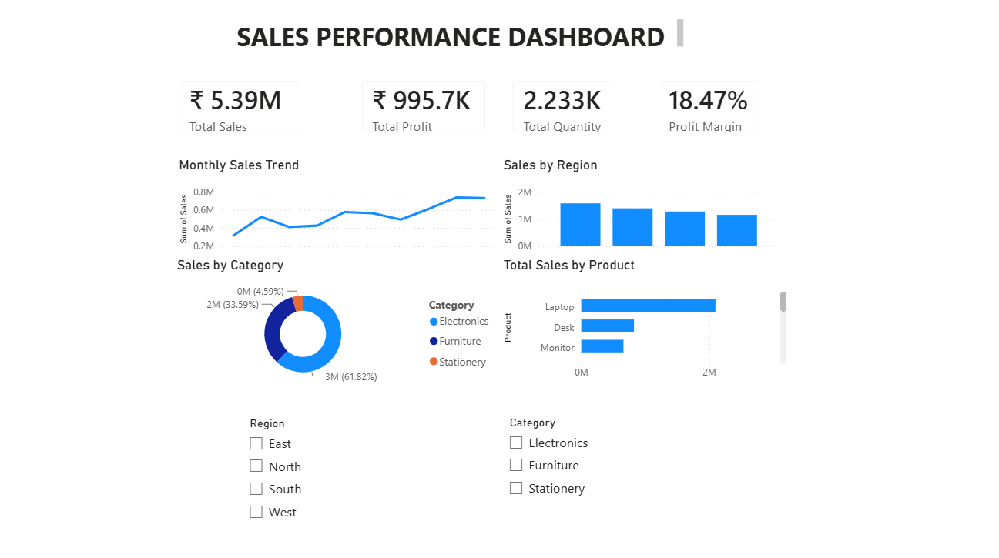

# Sales Data Analysis & Interactive Dashboard

## 📊 Project Overview

This project analyzes sales data to understand business performance, profitability, regional trends, product categories, and other key sales metrics.

An interactive dashboard was created using **Microsoft Power BI** to transform raw sales data into meaningful visual insights that can support data-driven business decisions.

## 🎯 Project Objectives

* Analyze overall sales and profitability performance
* Identify high-performing and underperforming regions
* Compare sales across product categories
* Analyze key sales and profit metrics
* Present business insights through an interactive dashboard
* Create a clear and user-friendly visualization for decision-making

## 🛠️ Tools & Technologies

* **Microsoft Power BI** — Dashboard development and data visualization
* **Microsoft Excel** — Data preparation and analysis
* **DAX** — Measures and calculations
* **GitHub** — Project version control and portfolio hosting

## 📁 Project Files

| File                   | Description                    |
| ---------------------- | ------------------------------ |
| `Sales_Data.xlsx`      | Source sales dataset           |
| `Sales_Dashboard.pbix` | Interactive Power BI dashboard |
| `DASHBOARD.png`        | Dashboard preview              |

## 📈 Dashboard

The dashboard provides an interactive view of sales performance, including:

* Sales performance
* Profitability
* Profit margin
* Regional analysis
* Category analysis
* Business performance indicators

### Dashboard Preview

## 🔍 Key Insights

The dashboard highlights important business metrics and allows users to interactively explore performance by **region** and **category**.

For example, the dashboard currently shows a **Profit Margin of approximately 18.47%**.

Additional insights can be explored directly through the Power BI dashboard using the available filters.

## 💡 Business Value

This project demonstrates how raw business data can be transformed into an interactive analytical solution.

The dashboard can help stakeholders:

* Monitor sales performance
* Identify profitable areas of the business
* Compare regional performance
* Understand category-level trends
* Support data-driven decision-making

## 🚀 How to Use

1. Download `Sales_Dashboard.pbix`.
2. Open it using **Microsoft Power BI Desktop**.
3. If required, update the data source to point to `Sales_Data.xlsx`.
4. Use the dashboard filters and visualizations to explore the data.

## 👨‍💻 Project Skills Demonstrated

* Data cleaning and preparation
* Data analysis
* Data visualization
* Dashboard development
* Power BI
* DAX
* Excel
* Business intelligence
* GitHub project management

## 📌 Project Status

**Completed — Interactive Sales Dashboard**

---

### Author

**Bhargava**

*Data Analytics | Power BI | Excel | Business Intelligence*
